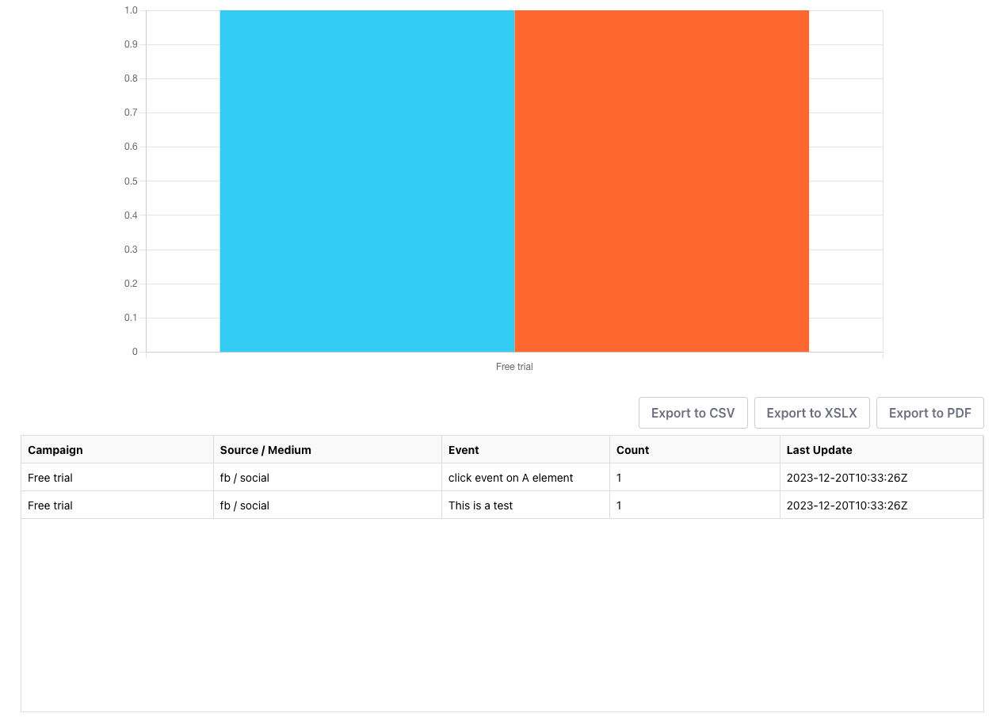
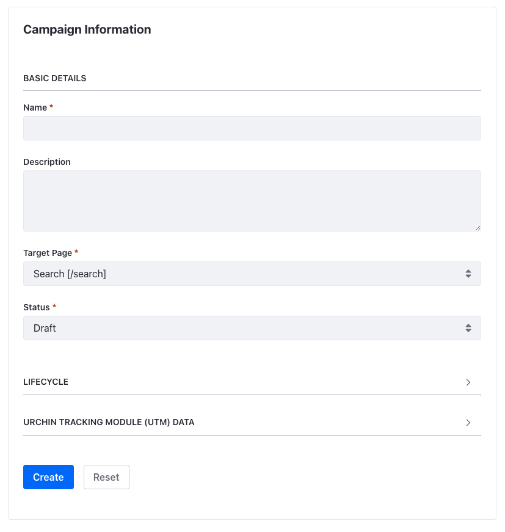
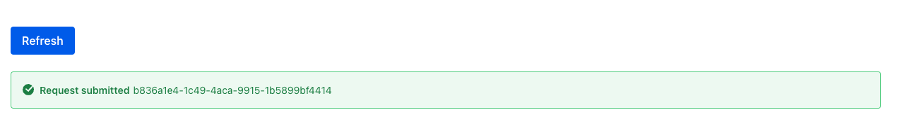
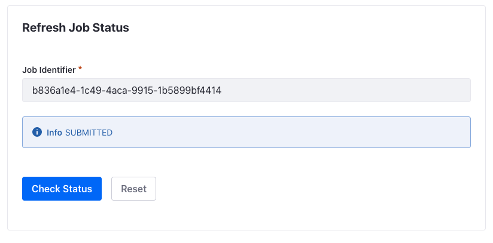
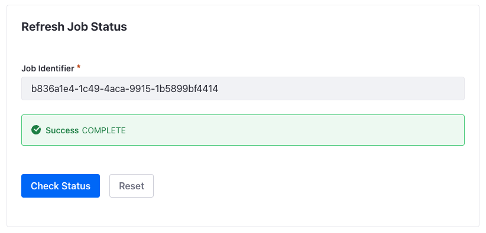

# pulse-workspace

Pulse as a Microservice Client Extension

## Order of Deployment

In order to honour the dependencies and avoid exceptions during deployment, you need to deploy the client extensions in the following order.

1. pulse-batch-object-dependencies
2. pulse-batch-object-definition
3. pulse-micro-service
4. pulse-batch-object-entry
5. pulse-reporting
6. pulse-user-interface-components

*You can deploy the pulse-micro-service before the pulse-object-definition to avoid exceptions in the logs suggesting the Object Actions are not defined but these will resolve themselves once the microservice is deployed.*

When the microservice is started it will attempt to refresh the cache from the Liferay Object definitions so this needs to be started once Liferay DXP is started.

### Setup, Reset and Deploy Scripts

There are three scripts in the root folder setupBundle.sh, resetBundle.sh and deployClientExtensions.sh. All three of these scripts are written for the Z shell (zsh), so may need slight amendments if they are run within another shell.

The setupBundle.sh is used to enable the release feature flags for a vanilla update. It also attempts to provide a developer license to the bundle.  

The restBundle.sh is useful for resetting the bundle to a vanilla installation. It simply deletes all client extensions, the state folder and the Hypersonic database and local elastic search data.

The deployClientExtensions.sh deploys a clean build of all of the client extensions within this workspace based on dependency. It also introduces delays to ensure the previous client extensions are applied before moving forward.

## User Interface Components

### Reporting

The Reporting give a user journey view of campaign interactions. This may include the initial Pulse touch-point / redirect and any further custom events which are recorded.

This custom web component, uses the User Agent defined within the microservice client extension to retrieve the required data from Liferay DXP.

### Campaign Creation

The Campaign Creation form is one of three UI components which are included in the pulse-user-interface-components client extension.

To include it on a page, add the Pulse UI Components widget to the page and then configure it by adding route=create-campaign to the Properties field within the Configuration panel.

This custom web component, uses the User Agent defined within the microservice client extension to submit the campaign to the Pulse microservice.

### Refresh Cache

The Refresh Cache button is a way to request a full refresh of the cache within Pulse. While Liferay Objects are used to persist the data, Pulse maintains an in-memory copy of the data to allow for responsive redirections.

To include it on a page, add the Pulse UI Components widget to the page. This component uses the default route, so it is not necessary to update the Configuration.

This custom web component, uses the User Agent defined within the microservice client extension to request the cache refresh. The microservice will return a job identifier which can be used to check the status of the request.

### Check Refresh Status

The Check Refresh Status component provides a way of checking the status of a request to the microservice to refresh its cache. There is a configurable option within the application.yaml which introduces a delay to better simulate a request taking longer to complete.

To include it on a page, add the Pulse UI Components widget to the page and then configure it by adding route=check-refresh-status to the Properties field within the Configuration panel.

This custom web component, uses the User Agent defined within the microservice client extension to check the status of the job.

## Testing the microservice

### Liferay OAuth2 Client

When the following is executed within a Liferay context then the list of URL tokens currently in the Pulse cache (H2 in-memory DB) is returned.

Liferay.OAuth2Client.FromUserAgentApplication("pulse-micro-service-oauth-application-user-agent").fetch("http://localhost:58080/api/url-tokens").then((response) => console.log(response))

The following will create a new campaign within the Pulse cache and also persist it using Liferay Objects.

Liferay.OAuth2Client.FromUserAgentApplication("pulse-micro-service-oauth-application-user-agent").fetch("http://localhost:58080/api/campaigns", {method:"POST",headers:{"Content-Type":"application/json"},body: JSON.stringify({name:"Test",campaignUrl:"/redirect"})}).then((response) => console.log(response))

**At this time there are issues with the  Liferay OAuth2 Client. It does not pass the Bearer token when the headers are overridden and in the case of this example, the content type needs to be set to application/json in order to be accepted by the microservice API.
In order to work around this, the _getOrRequestToken() method is being used and this does not refresh the Bearer token which can lead to 401 responses**

### Curl

The following CURL command will create a new campaign within the Pulse cache and also persist it using Liferay Objects.

curl \
--verbose \
--header "Content-Type: application/json" \
--header "Authorization: Bearer <token>" \
--request POST \
--data '{"name":"Test","campaignUrl":"/redirect"}' \
http://localhost:58080/api/campaigns