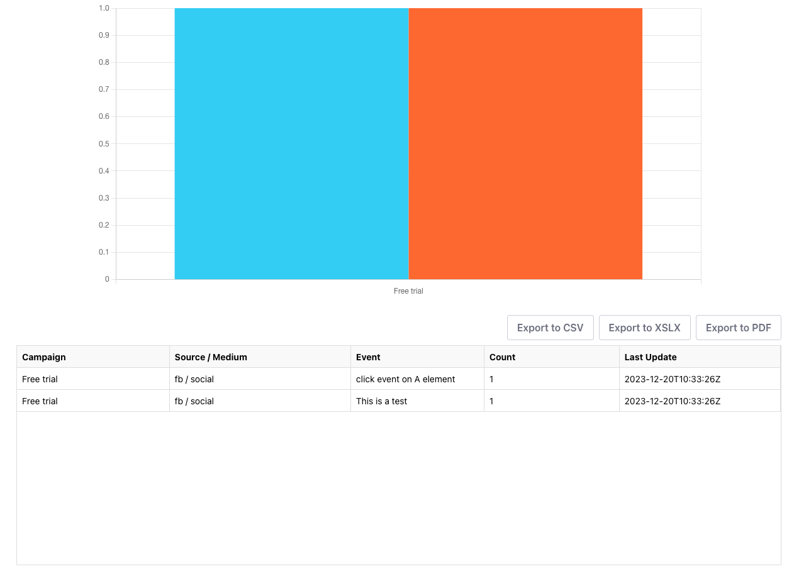
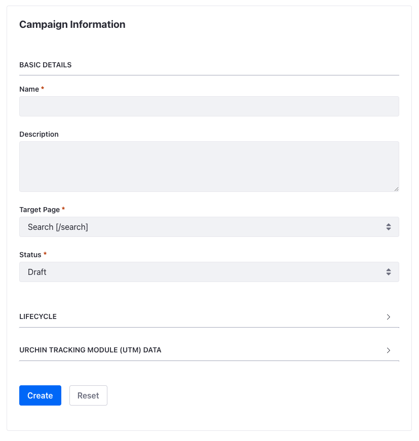
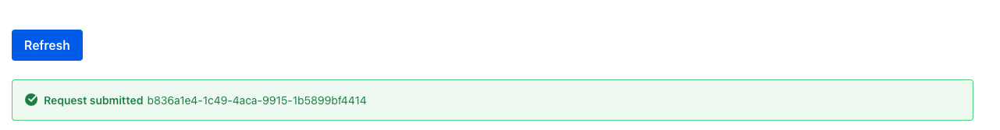
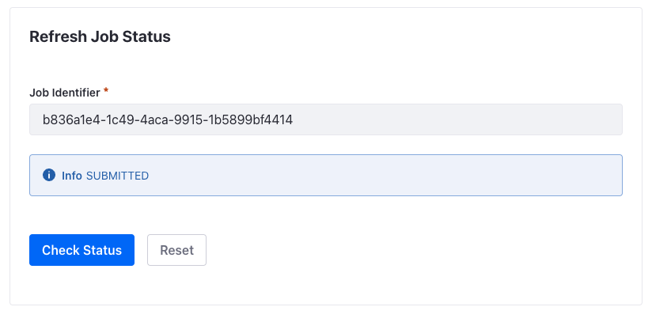
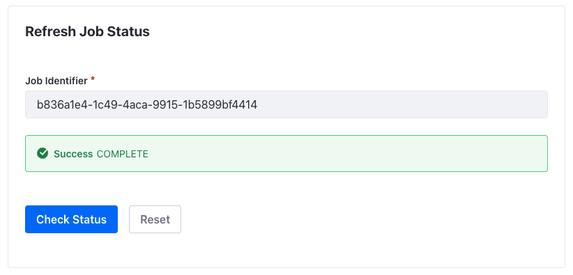

# pulse-workspace

Pulse as a Microservice Client Extension

## LXC SM Deployment

### Liferay Configuration / Dependencies

The workspace is configured to use the latest Liferay product version.

liferay.workspace.product=2025.q4.12

The Pulse microservice has been upgraded to **Spring Boot 3.4.2** and **Java 21**. It requires a minimum of JDK 17 to run, but is specifically optimized for JDK 21.

If your CI/CD environment (e.g., Jenkins) uses an older JDK by default, you may need to explicitly point Gradle to the correct Java home in *gradle.properties*.

#org.gradle.java.home=/opt/java/openjdk21

### Domains and Cookies
Pulse shares information with Liferay DXP via cookies and therefore, there needs to be a common parent domain. In the case of LXC SM, this could either be lfr.cloud but it could also be a custom domain. In the case of a custom domain, both the Liferay web server and the Pulse microservice need a subdomains with a common parent domains. For example, the DXP could be assigned www.example.com, in which case, Pulse would need something like p.example.com.

### Pulse Environment Variables

There are several environment variables that you need to populate.

The PULSE_COOKIE_DOMAIN variable needs to be set to the parent domain. In the case, where no custom domain is used, then this would be *ltr.cloud* and in the example.com, case, this would be *example.com*.

### LXC / Client Extension Environment Variables

At the time of writing this, there are some additonial environment variables which are needed to make the Pulse microservice run on LXC SM (PaaS). More details can be found [here](https://help.liferay.com/hc/en-us/articles/22907563368589)

In the case of COM_LIFERAY_LXC_DXP_DOMAINS, COM_LIFERAY_LXC_DXP_MAINDOMAIN and COM_LIFERAY_LXC_DXP_MAIN_DOMAIN the value is the same. In the example.com example, the value of all three will be *www.example.com*, i.e. the hostname of the Liferay DXP instance. It should not be prefixed with the scheme, i.e. https:// or have any trailing slashes.

The value of COM_LIFERAY_LXC_DXP_SERVER_PROTOCOL should reflect the scheme being used to access the Liferay DXP. In most cases this will just be *https*.

There are two environment variables which are needex for LXC deployment. However, problems can be experienced if they are not included here too. The value of LIFERAY_ROUTES_CLIENT_EXTENSION should be */etc/liferay/lxc/ext-init-metadata* and the value of LIFERAY_ROUTES_DXP should be */etc/liferay/lxc/dxp-metadata*.

### OAuth2 Environment Variables

The name of the keys are dependent on the name of the external reference code (ERC) of the OAuth2 configuration. In the case of Pulse there are two, one for the User Agent and one for the Headless Server. In the client-extension.yaml, these are pulse-micro-service-oauth-application-user-agent and pulse-micro-service-oauth-application-headless-server, respectively.

However, to make them valid key names, there is a little transformation needed, i.e. transform the ERC to upper case and remove the hyphens. Therefore, the key prefixes become PULSEMICROSERVICEOAUTHAPPLICATIONUSERAGENT and PULSEMICROSERVICEOAUTHAPPLICATIONHEADLESSSERVER, respectively.

The table below explains the values needed for each of these environment variables.

**It is recommended that all of the following are set in the the LCP.json except the CLIENT_IDs and CLIENT_SECRET values, which should always be supplied via the console.**

**This table is large due to the key names, so you will need to scroll**

| Environment Variable Name / Key | Environment Variable Value | Notes |
| ------------------------------- | -------------------------- | ----- |
| PULSEMICROSERVICEOAUTHAPPLICATIONHEADLESSSERVER_OAUTH2_AUTHORIZATION_URI | /o/oauth2/authorize | This value should always be the same |
| PULSEMICROSERVICEOAUTHAPPLICATIONHEADLESSSERVER_OAUTH2_HEADLESS_SERVER_AUDIENCE | https://www.example.com | Using the example.com, example this will be the url to access the Liferay DXP |
| PULSEMICROSERVICEOAUTHAPPLICATIONHEADLESSSERVER_OAUTH2_HEADLESS_SERVER_CLIENT_ID | id-xxxxxxxx-xxxx-xxxx-xxxx-xxxxxxxxxxxx | This value can be found in Liferay DXP, in the OAuth 2 Administration entry |
| PULSEMICROSERVICEOAUTHAPPLICATIONHEADLESSSERVER_OAUTH2_HEADLESS_SERVER_CLIENT_SECRET | secret-xxxxxxxx-xxxx-xxxx-xxxx-xxxxxxxxxxxx | This value can be found in Liferay DXP, in the OAuth 2 Administration entry |
| PULSEMICROSERVICEOAUTHAPPLICATIONHEADLESSSERVER_OAUTH2_HEADLESS_SERVER_SCOPES | C_Acquisition.everything,C_Campaign.everything,C_CampaignInteraction.everything,C_UrlToken.everything | This value should be the same but can be confirmed in the OAuth 2 entry in Liferay DXP |
| PULSEMICROSERVICEOAUTHAPPLICATIONHEADLESSSERVER_OAUTH2_INTROSPECTION_URI | /o/oauth2/introspection | This value should always be the same |
| PULSEMICROSERVICEOAUTHAPPLICATIONHEADLESSSERVER_OAUTH2_JWKS_URI | /o/oauth2/jwks | This value should always be the same |
| PULSEMICROSERVICEOAUTHAPPLICATIONHEADLESSSERVER_OAUTH2_TOKEN_URI | /o/oauth2/token | This value should always be the same |
| PULSEMICROSERAUTHAPPLICATIONUSERAGENT_OAUTH2_AUTHORIZATION_URI| /o/oauth2/authorize | This value should always be the same |
| PULSEMICROSERVICEOAUTHAPPLICATIONUSERAGENT_OAUTH2_INTROSPECTION_URI | /o/oauth2/introspectione | This value should always be the same |
| PULSEMICROSERVICEOAUTHAPPLICATIONUSERAGENT_OAUTH2_JWKS_URI | /o/oauth2/jwks | This value should always be the same |
| PULSEMICROSERVICEOAUTHAPPLICATIONUSERAGENT_OAUTH2_REDIRECT_URIS | /o/oauth2/redirect | This value should always be the same |
| PULSEMICROSERVICEOAUTHAPPLICATIONUSERAGENT_OAUTH2_TOKEN_URI | /o/oauth2/token | This value should always be the same |
| PULSEMICROSERVICEOAUTHAPPLICATIONUSERAGENT_OAUTH2_USER_AGENT_AUDIENCE | https://www.example.com | Using the example.com, example this will be the url to access the Liferay DXP |
| PULSEMICROSERVICEOAUTHAPPLICATIONUSERAGENT_OAUTH2_USER_AGENT_CLIENT_ID | id-xxxxxxxx-xxxx-xxxx-xxxx-xxxxxxxxxxxx | This value can be found in Liferay DXP, in the OAuth 2 Administration entry |
| PULSEMICROSERVICEOAUTHAPPLICATIONUSERAGENT_OAUTH2_USER_AGENT_SCOPES | C_Acquisition.everything,C_Campaign.everything,C_CampaignInteraction.everything,C_UrlToken.everything,Liferay.Headless.Admin.List.Type.everything.read,Liferay.Headless.Delivery.everything.read  | This value should be the same but can be confirmed in the OAuth 2 entry in Liferay DXP |

### Client Extensions Deployment

All of the client extensions, need to be built and deployed via the CI / CD process in LXC SM, including the Pulse microservice. However, in the case of the microservice, only the configuration needed by Liferay DXP is used. In order to deploy the microservice to the environment, it is necessary to use the lcp command, more details can be found in the [Liferay documentation](https://learn.liferay.com/w/courses/cloud-administrator/deploying-code-to-lxc/deploying-and-managing-a-microservice-client-extension-project).

## User Interface Components

### Reporting

The Reporting give a user journey view of campaign interactions. This may include the initial Pulse touch-point / redirect and any further custom events which are recorded.

This custom web component, uses the User Agent defined within the microservice client extension to retrieve the required data from Liferay DXP.

Frontend dependencies have been hardened against security vulnerabilities (jsPDF v4.2.1, SheetJS v0.20.3).

### Campaign Creation

The Campaign Creation form is one of three UI components which are included in the pulse-user-interface-components client extension.

To include it on a page, add the Pulse UI Components widget to the page and then configure it by adding route=create-campaign to the Properties field within the Configuration panel.

This custom web component, uses the User Agent defined within the microservice client extension to submit the campaign to the Pulse microservice.

### Refresh Cache

The Refresh Cache button is a way to request a full refresh of the cache within Pulse. While Liferay Objects are used to persist the data, Pulse maintains an in-memory copy of the data to allow for responsive redirections.

To include it on a page, add the Pulse UI Components widget to the page. This component uses the default route, so it is not necessary to update the Configuration.

This custom web component, uses the User Agent defined within the microservice client extension to request the cache refresh. The microservice will return a job identifier which can be used to check the status of the request.

### Check Refresh Status

The Check Refresh Status component provides a way of checking the status of a request to the microservice to refresh its cache. There is a configurable option within the application.yaml which introduces a delay to better simulate a request taking longer to complete.

To include it on a page, add the Pulse UI Components widget to the page and then configure it by adding route=check-refresh-status to the Properties field within the Configuration panel.

This custom web component, uses the User Agent defined within the microservice client extension to check the status of the job.

## Testing the microservice

### Liferay OAuth2 Client

When the following is executed within a Liferay context then the list of URL tokens currently in the Pulse cache (H2 in-memory DB) is returned.

Liferay.OAuth2Client.FromUserAgentApplication("pulse-micro-service-oauth-application-user-agent").fetch("/api/url-tokens").then((response) => console.log(response))

The following will create a new campaign within the Pulse cache and also persist it using Liferay Objects.

Liferay.OAuth2Client.FromUserAgentApplication("pulse-micro-service-oauth-application-user-agent").fetch("/api/campaigns", {method:"POST",headers:{"Content-Type":"application/json"},body: JSON.stringify({name:"Test",campaignUrl:"/redirect"})}).then((response) => console.log(response))

**At this time there are issues with the  Liferay OAuth2 Client. It does not pass the Bearer token when the headers are overridden and in the case of this example, the content type needs to be set to application/json in order to be accepted by the microservice API.
In order to work around this, the _getOrRequestToken() method is being used and this does not refresh the Bearer token which can lead to 401 responses**

### Curl

The following CURL command will create a new campaign within the Pulse cache and also persist it using Liferay Objects.

curl \
--verbose \
--header "Content-Type: application/json" \
--header "Authorization: Bearer <token>" \
--request POST \
--data '{"name":"Test","campaignUrl":"/redirect"}' \
http://localhost:58080/api/campaigns
